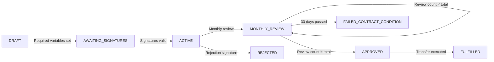

# Grant Agreement Template Variables and State Machine

## Variable Types

The grant agreement template uses several variable types to manage different aspects of the grant process:

### Basic Types
- `date`: Timestamps for events (e.g., `effectiveDate`, `lastUpdated`)
- `integer`: Whole numbers for counting (e.g., `monthlyReviewCount`, `numberOfMonths`)
- `uint256`: Blockchain-compatible unsigned integers (e.g., `grantAmount`)

### Signature Type
- `eip712Signature`: Ethereum-standard structured signatures that include:
  - Signer address
  - Signature parameters (name, version, chainId, contract)
  - Message payload

## Variable Categories

Variables are organized into categories:
- `global`: General purpose variables used across the agreement
- `blockchain`: Variables specifically related to on-chain operations

## State Machine Integration

### Variable Usage in State Transitions

Variables are used in the state machine through:

1. **Condition Checks**
   - `variablesSet`: Verifies required variables are populated
   - `signatureValid`: Validates EIP712 signatures
   - `comparison`: Compares variable values using operators like:
     - equals
     - lessThan
     - greaterThan

2. **Variable Updates**
   - `setVariable`: Directly sets a variable value
   - `incrementVariable`: Increases a counter variable

### Example Flow

### Variable References

Variables can be referenced in conditions using the `${variableName}` syntax. Complex expressions are also supported:
- Time-based: `${lastUpdated + 30 days}`
- Comparisons: `${monthlyReviewCount} < ${numberOfMonths}`

### State Machine Actions

When transitions occur, the state machine can:
1. Update variable values
2. Record timestamps
3. Increment counters
4. Trigger blockchain transactions

## Template Interpolation

Variables are interpolated throughout the template using the `${variableName}` syntax in:
- Prose sections
- Blockchain transaction parameters
- Identity fields
- Signature message payloads
