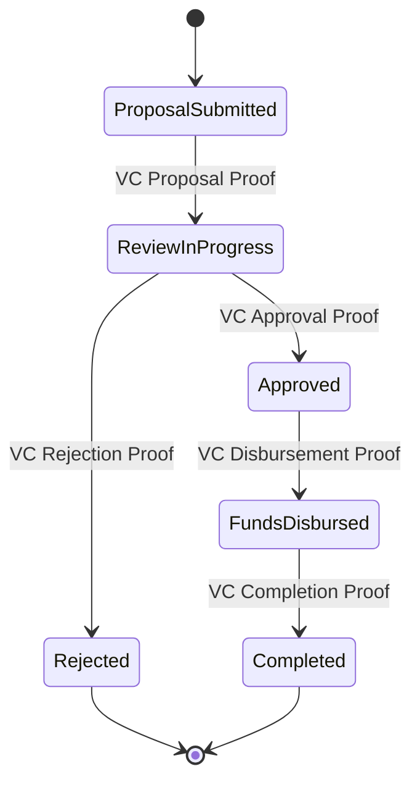
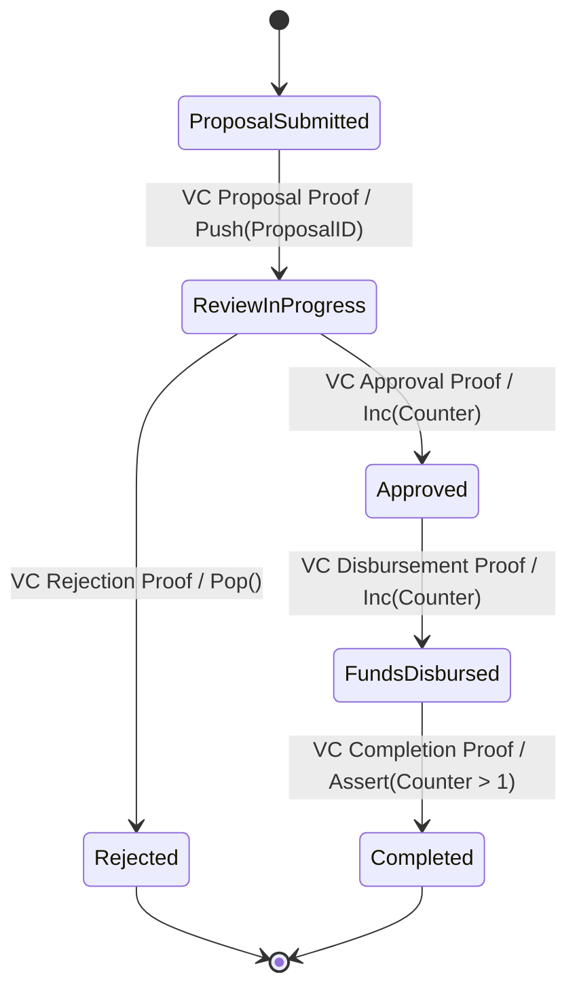
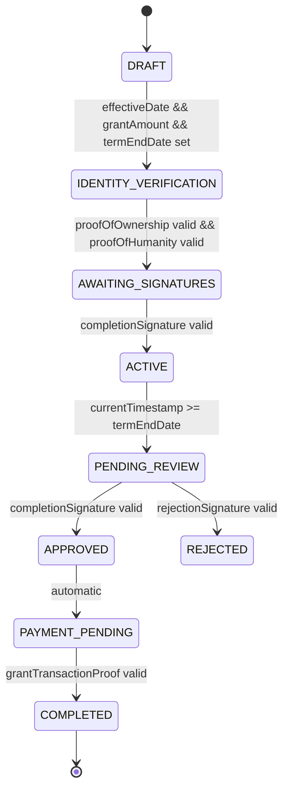
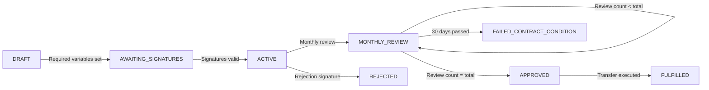

$\color{red}{\Huge{\textsf{This is a WIP. TODO: Separate into V1 based on an a DFSM and V2 based on an ASM}}}$

# V1 Example: DFSM-Based Grant Legal Agreement

Deterministic Finite State Machine (DFSM)

Transitions occur only based on provable inputs (e.g., Verifiable Credentials (VCs) and Zero-Knowledge (ZK) proofs).
No memory (beyond the current state), counters, or stack.

Each transition is strictly triggered by a Verifiable Credential (VC) or ZK Proof.
No variables, counters, or complex computation—only state-to-state transitions.

# V2 Example: ASM-Based Grant Legal Agreement

Uses a stack to track Proposal IDs.
Uses a counter to keep track of state transitions (e.g., tracking multiple approvals or fund disbursements).
Assertions (e.g., checking Counter > 1) ensure that certain conditions hold before a transition.
Still event-driven and reliant on provable inputs (VCs, ZK proofs).

| Feature                              | DFSM | ASM |
|--------------------------------------|------|-----|
| **State Transitions**                | ✅   | ✅  |
| **Provable Inputs Only (VC/ZK Proofs)** | ✅ | ✅ |
| **Memory (Counters, Stack)**         | ❌   | ✅  |
| **Computation Between Transitions**  | ❌   | ✅  |
| **Complex Logic (Assertions, Conditions)** | ❌ | ✅ |

----

Sample Grant Agreeement using DFSM (see https://github.com/ConsenSysMesh/agreements-protocol/blob/master/src/templates/grant-agreement-DFSM.json as input)

----

# Grant Agreement Template Variables and State Machine

## Variable Types

The grant agreement template uses several variable types to manage different aspects of the grant process:

### Basic Types
- `date`: Timestamps for events (e.g., `effectiveDate`, `lastUpdated`)
- `integer`: Whole numbers for counting (e.g., `monthlyReviewCount`, `numberOfMonths`)
- `uint256`: Blockchain-compatible unsigned integers (e.g., `grantAmount`)

### Signature Type
- `eip712Signature`: Ethereum-standard structured signatures that include:
  - Signer address
  - Signature parameters (name, version, chainId, contract)
  - Message payload

## Variable Categories

Variables are organized into categories:
- `global`: General purpose variables used across the agreement
- `blockchain`: Variables specifically related to on-chain operations

## State Machine Integration

### Variable Usage in State Transitions

Variables are used in the state machine through:

1. **Condition Checks**
   - `variablesSet`: Verifies required variables are populated
   - `signatureValid`: Validates EIP712 signatures
   - `comparison`: Compares variable values using operators like:
     - equals
     - lessThan
     - greaterThan

2. **Variable Updates**
   - `setVariable`: Directly sets a variable value
   - `incrementVariable`: Increases a counter variable

### Example Flow

### Variable References

Variables can be referenced in conditions using the `${variableName}` syntax. Complex expressions are also supported:
- Time-based: `${lastUpdated + 30 days}`
- Comparisons: `${monthlyReviewCount} < ${numberOfMonths}`

### State Machine Actions

When transitions occur, the state machine can:
1. Update variable values
2. Record timestamps
3. Increment counters
4. Trigger blockchain transactions

## Template Interpolation

Variables are interpolated throughout the template using the `${variableName}` syntax in:
- Prose sections
- Blockchain transaction parameters
- Identity fields
- Signature message payloads
