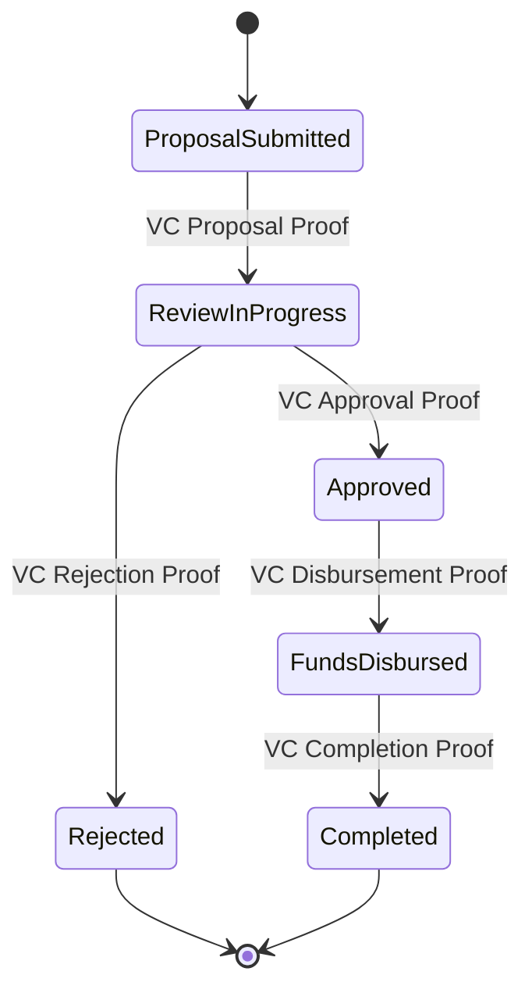
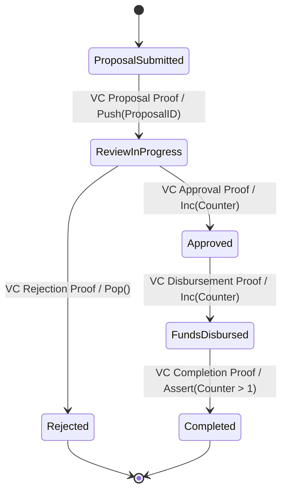
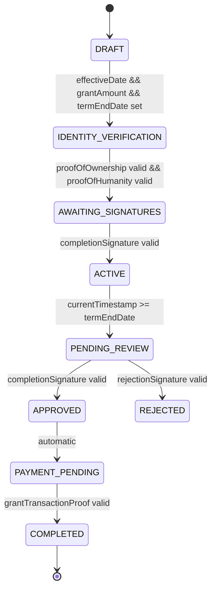

The next section of this document just describes some of the interesting differences between the V1 and V2 proposed versions.

# V1 Example: DFSM-Based Grant Legal Agreement

Deterministic Finite State Machine (DFSM)

Transitions occur only based on provable inputs (e.g., Verifiable Credentials (VCs) and Zero-Knowledge (ZK) proofs).
No memory (beyond the current state), counters, or stack.

Each transition is strictly triggered by a Verifiable Credential (VC) or ZK Proof.
No variables, counters, or complex computation—only state-to-state transitions.

# V2 Example: ASM-Based Grant Legal Agreement

Uses a stack to track Proposal IDs.
Uses a counter to keep track of state transitions (e.g., tracking multiple approvals or fund disbursements).
Assertions (e.g., checking Counter > 1) ensure that certain conditions hold before a transition.
Still event-driven and reliant on provable inputs (VCs, ZK proofs).

| Feature                              | DFSM | ASM |
|--------------------------------------|------|-----|
| **State Transitions**                | ✅   | ✅  |
| **Provable Inputs Only (VC/ZK Proofs)** | ✅ | ✅ |
| **Memory (Counters, Stack)**         | ❌   | ✅  |
| **Computation Between Transitions**  | ❌   | ✅  |
| **Complex Logic (Assertions, Conditions)** | ❌ | ✅ |

----

Sample Grant Agreeement using DFSM (see https://github.com/ConsenSysMesh/agreements-protocol/blob/master/src/templates/grant-agreement-DFSM.json as input)

