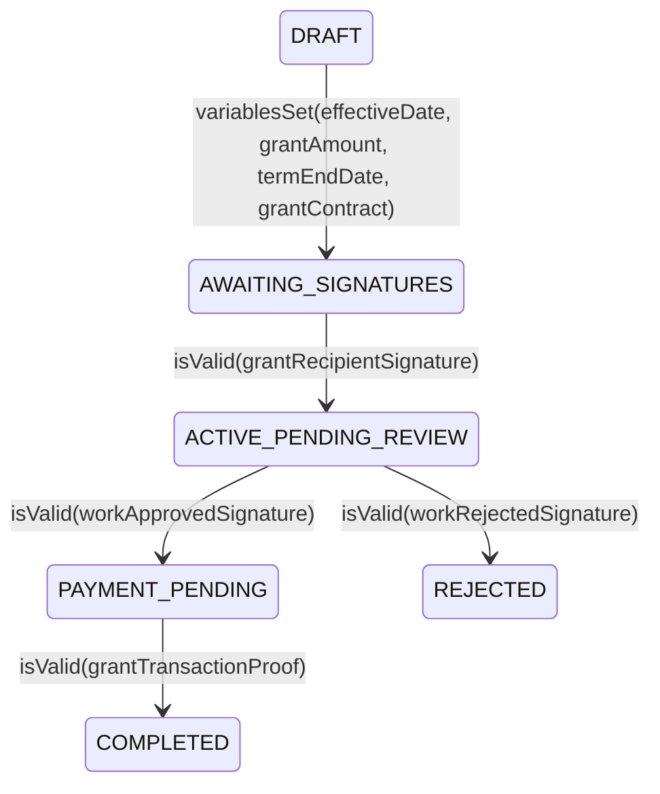

```mermaid
stateDiagram-v2
    DRAFT --> AWAITING_SIGNATURES: variablesSet(effectiveDate, grantAmount, termEndDate, grantContract)
    AWAITING_SIGNATURES --> ACTIVE_PENDING_REVIEW: isValid(grantRecipientSignature)
    ACTIVE_PENDING_REVIEW --> PAYMENT_PENDING: isValid(workApprovedSignature)
    ACTIVE_PENDING_REVIEW --> REJECTED: isValid(workRejectedSignature)
    PAYMENT_PENDING --> COMPLETED: isValid(grantTransactionProof)
```