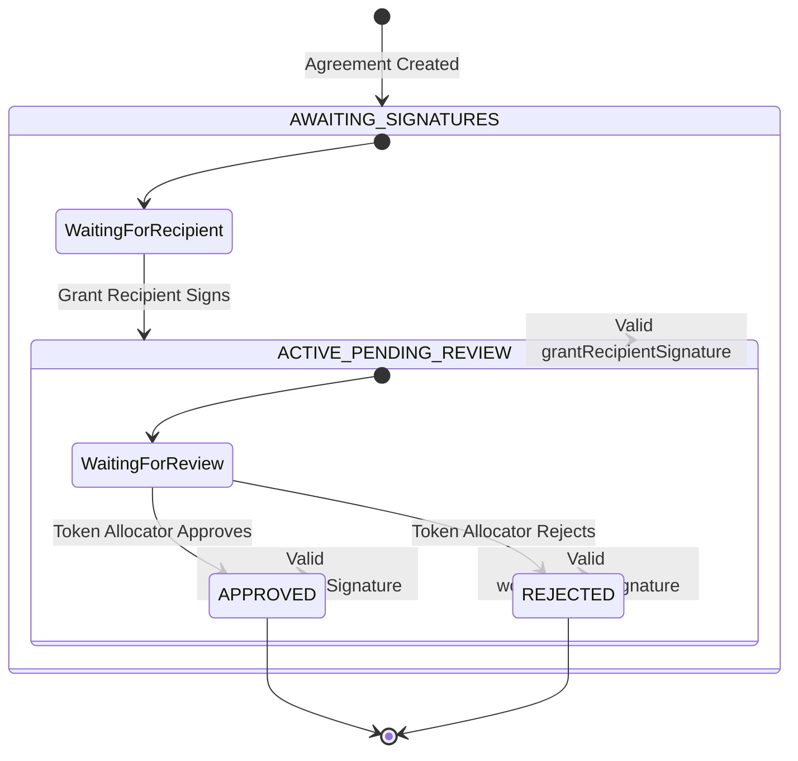

# Grant Agreement State Machine

This diagram represents the state machine that governs the lifecycle of a grant agreement.

## State Descriptions

- **AWAITING_SIGNATURES**: Initial state where the agreement waits for the grant recipient to sign
- **ACTIVE_PENDING_REVIEW**: Agreement is active and waiting for the token allocator to review the work
- **APPROVED**: Final state indicating successful completion of the grant work
- **REJECTED**: Final state indicating the grant work was not satisfactory

## Transitions

1. Agreement starts in AWAITING_SIGNATURES state
2. Moves to ACTIVE_PENDING_REVIEW when grant recipient provides valid signature
3. Can transition to either APPROVED or REJECTED based on token allocator's review
4. Both APPROVED and REJECTED are terminal states