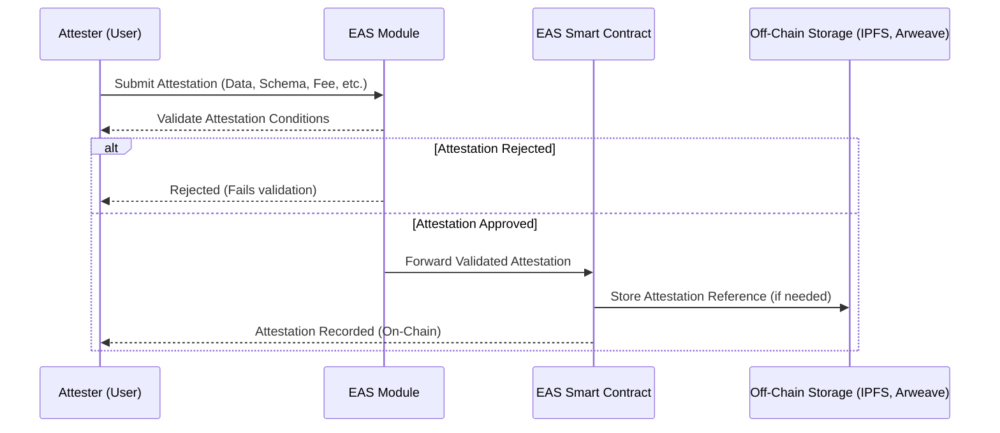

## Solidity Execution Implementation (TODO)

This folder contains the implementation of the Solidity execution.

# IDEA

Maximize EVM usage of the standard.

## Key Benefits

* On-chain accessibility to other contracts, and also availability to agreement state.

## Downsides

* Conversion from JSON definition to on-chain contract calls (including likely multiple deployments of contracts) required.

## Potential Implementation

Implement FSM on-chain and combine with EAS or Verax for attestations.

# EAS

Could be used to reference agreement document, and further signatures/attestations against that document.

## Key Benefits

* On-chain availability of attestations
* Ability to use modules to gate attestations

## Downsides
* Document content off-chain (IPFS or AR)
* App-layer conversion from agreement document to deployment plan (i.e. a code composer + deployer for agreements and related contracts.)

Here is how an EAS attestation with a module would work:

# Implementation flow

1. [Document Upload + Attestation](./document-upload.md)

