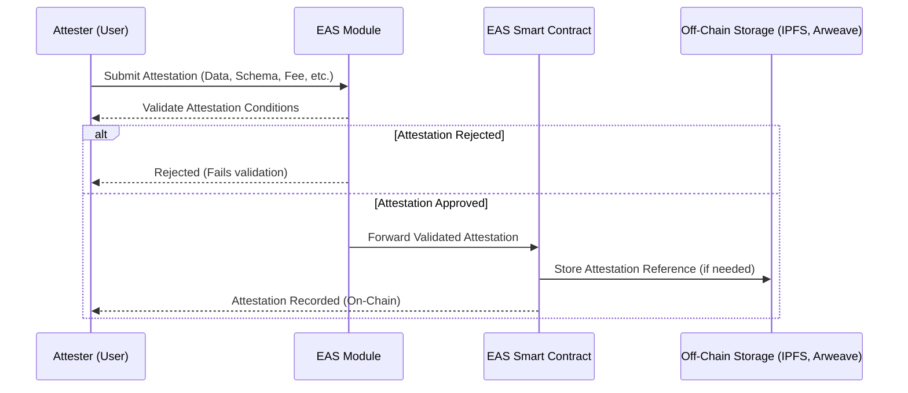
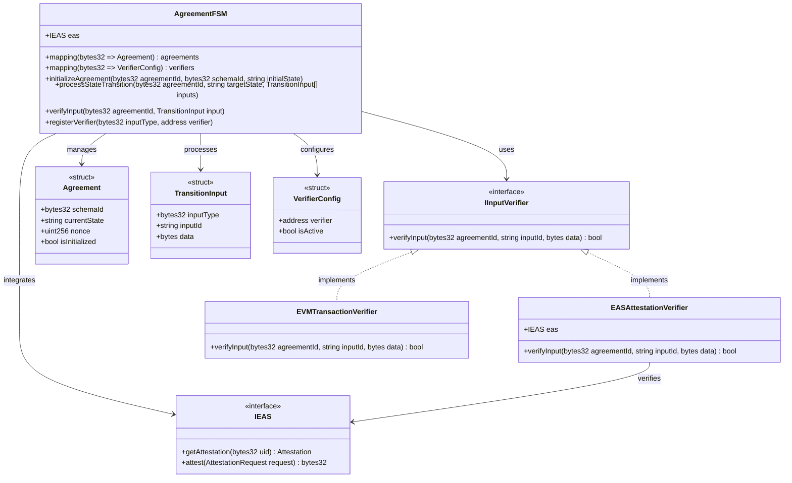
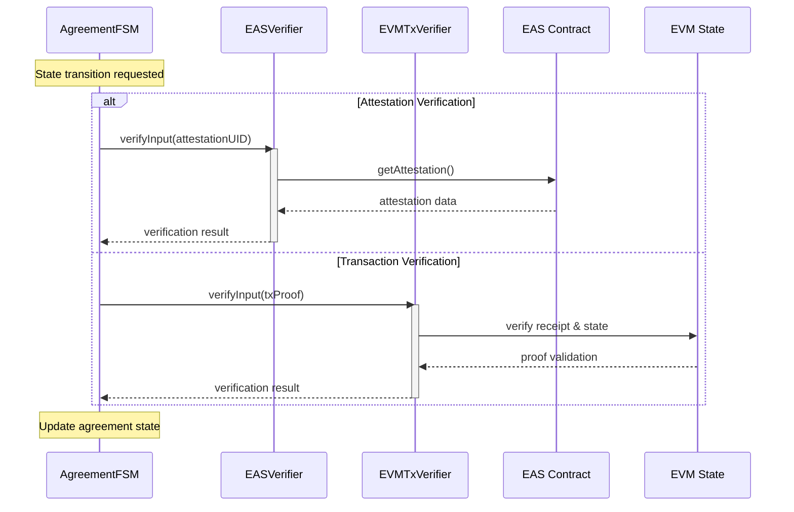

## Solidity Execution Implementation (TODO)

This folder contains the implementation of the Solidity execution.

# IDEA

Maximize EVM usage of the standard.

## Key Benefits

* On-chain accessibility to other contracts, and also availability to agreement state.

## Downsides

* Conversion from JSON definition to on-chain contract calls (including likely multiple deployments of contracts) required.

## Potential Implementation

Implement FSM on-chain and combine with EAS or Verax for attestations.

# EAS

Could be used to reference agreement document, and further signatures/attestations against that document.

## Key Benefits

* On-chain availability of attestations
* Ability to use modules to gate attestations

## Downsides
* Document content off-chain (IPFS or AR)
* App-layer conversion from agreement document to deployment plan (i.e. a code composer + deployer for agreements and related contracts.)

Here is how an EAS attestation with a module would work:



# On-chain Finite state machine 

This solution, after [considering various options](./on-chain-fsm.md), involves implementing an on-chain FSM with Pluggable Verifiers, that include both EAS attestations and EVM transactions.

Here is a starting point for a [Solidity-based implementation of this solution](./fsm-with-pluggable-verifiers.sol).

This solution allows adding new verifier types in a modular fashion, and keeping the state machine contract code generic.

## Class Diagram for FSM



## State Transition Flow




# Implementation Flow

1. [Document Upload + Attestation](./document-upload.md)
2. [Providing VC against Original Document](./signature-upload.md)
3. Interacting with [FSM contract](./fsm-with-pluggable-verifiers.sol) to provide inputs:

```typescript
// Contract interfaces and types
interface AgreementFSM {
    processStateTransition(
        agreementId: string,
        targetState: string,
        inputs: TransitionInput[]
    ): Promise<ContractTransaction>;
}

interface TransitionInput {
    inputType: string;
    inputId: string;
    data: string;
}

// Example: Processing payment verification state transition
async function processPaymentVerification(
    fsmContract: AgreementFSM,
    agreementId: string,
    params: {
        signatureAttestationUID: string;
        paymentTxHash: string;
        paymentBlockNumber: number;
        paymentBlockHash: string;
        merkleProof: string;
    }
) {
    const EAS_ATTESTATION_TYPE = ethers.utils.id("EAS_ATTESTATION");
    const EVM_TX_PROOF_TYPE = ethers.utils.id("EVM_TX_PROOF");

    // Construct transition inputs
    const inputs: TransitionInput[] = [
        // 1. Work approval signature attestation
        {
            inputType: EAS_ATTESTATION_TYPE,
            inputId: "workApprovedSignature",
            data: ethers.utils.defaultAbiCoder.encode(
                ["bytes32"],
                [params.signatureAttestationUID]
            )
        },
        // 2. Payment transaction proof
        {
            inputType: EVM_TX_PROOF_TYPE,
            inputId: "grantTransactionProof",
            data: ethers.utils.defaultAbiCoder.encode(
                [
                    "tuple(bytes32 txHash, uint256 blockNumber, bytes32 blockHash, bytes merkleProof)"
                ],
                [{
                    txHash: params.paymentTxHash,
                    blockNumber: params.paymentBlockNumber,
                    blockHash: params.paymentBlockHash,
                    merkleProof: params.merkleProof
                }]
            )
        }
    ];

    // Process state transition
    const tx = await fsmContract.processStateTransition(
        agreementId,
        "COMPLETED",  // Target state from executionFlow
        inputs
    );

    return tx;
}

// Example usage
async function main() {
    // Contract setup
    const FSM_CONTRACT_ADDRESS = "0x...";
    const provider = new ethers.providers.JsonRpcProvider(RPC_URL);
    const signer = new ethers.Wallet(PRIVATE_KEY, provider);
    const fsmContract = new ethers.Contract(
        FSM_CONTRACT_ADDRESS,
        FSM_ABI,
        signer
    ) as AgreementFSM;

    // Agreement parameters
    const AGREEMENT_ID = "0x...";
    
    // 1. Get the EAS attestation for work approval
    const workApprovalUID = "0x..."; // From previous EAS attestation

    // 2. Get the payment transaction proof
    const paymentTx = "0x..."; // Transaction hash of the payment
    const proof = await getTransactionProof(provider, paymentTx);

    // Process the state transition
    const result = await processPaymentVerification(
        fsmContract,
        AGREEMENT_ID,
        {
            signatureAttestationUID: workApprovalUID,
            paymentTxHash: proof.txHash,
            paymentBlockNumber: proof.blockNumber,
            paymentBlockHash: proof.blockHash,
            merkleProof: proof.merkleProof
        }
    );

    console.log("State transition processed:", result.hash);
}

// Helper function to get transaction proof
async function getTransactionProof(
    provider: ethers.providers.Provider,
    txHash: string
): Promise<{
    txHash: string;
    blockNumber: number;
    blockHash: string;
    merkleProof: string;
}> {
    // Get transaction receipt
    const receipt = await provider.getTransactionReceipt(txHash);
    
    // Get block
    const block = await provider.getBlock(receipt.blockNumber);
    
    // Generate merkle proof (implementation depends on your proof generation method)
    const merkleProof = await generateMerkleProof(
        receipt.blockNumber,
        txHash
    );

    return {
        txHash,
        blockNumber: receipt.blockNumber,
        blockHash: block.hash,
        merkleProof
    };
}

// Example merkle proof generation (simplified)
async function generateMerkleProof(
    blockNumber: number,
    txHash: string
): Promise<string> {
    // Implementation would depend on your chosen method for proof generation
    // Could use:
    // - eth-proof library
    // - Custom RPC endpoint with proof generation
    // - External proof service
    
    return "0x..."; // Encoded merkle proof
}

// Example monitoring state transition
async function monitorStateTransition(
    fsmContract: AgreementFSM,
    txHash: string
) {
    const receipt = await provider.getTransactionReceipt(txHash);
    
    // Find StateTransitioned event
    const stateTransitionedEvent = receipt.logs
        .map(log => {
            try {
                return fsmContract.interface.parseLog(log);
            } catch {
                return null;
            }
        })
        .find(event => event?.name === "StateTransitioned");

    if (stateTransitionedEvent) {
        console.log("State transition successful:");
        console.log("From:", stateTransitionedEvent.args.fromState);
        console.log("To:", stateTransitionedEvent.args.toState);
        console.log("Nonce:", stateTransitionedEvent.args.nonce.toString());
    }
}
```