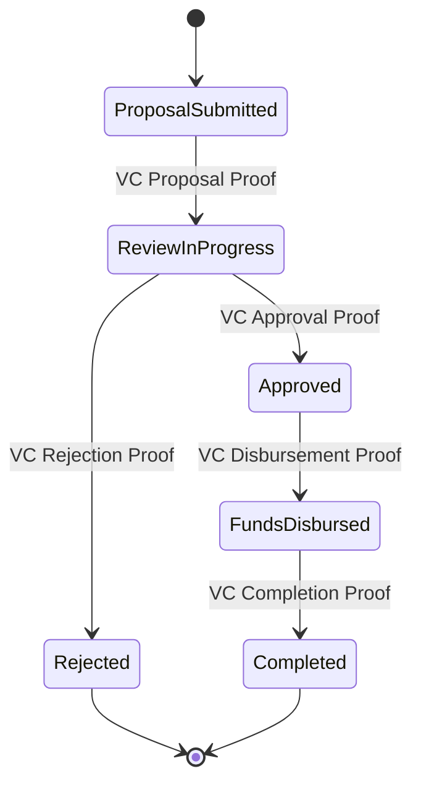
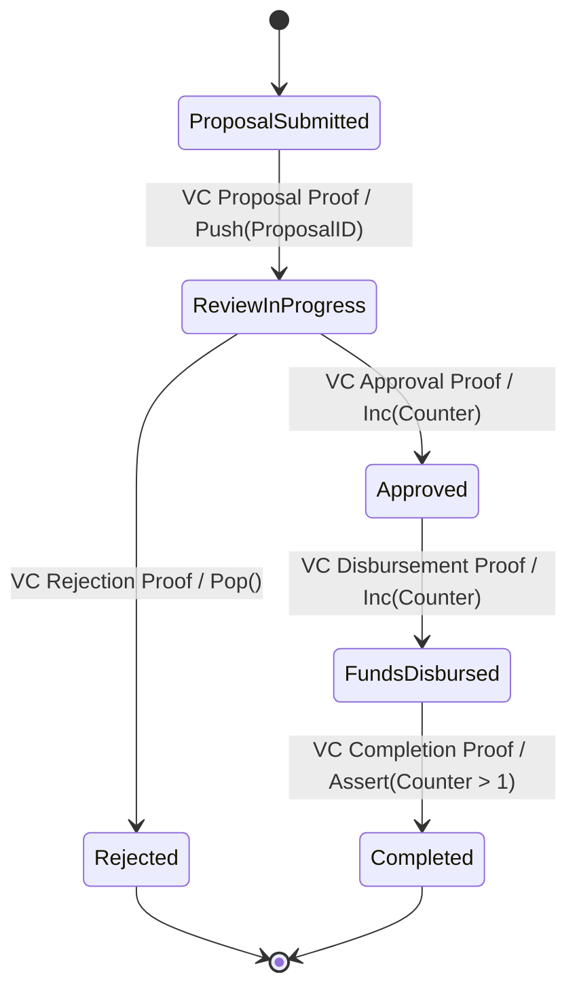
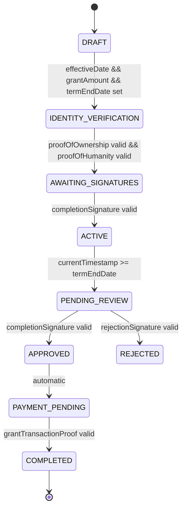

## IP-001 (DRAFT): Transition from DFSM to ASM (Abstract State Machine)

While the current version uses a deterministic finite state machine approach, **this version will transition to an abstract state machine model**, enabling significantly more powerful and flexible agreement structures.

### Key Enhancements in v.next

1. **Turing-Complete Expression Language**
   - Support for complex expressions and computations within conditions
   - Ability to define custom functions and operations
   - Integration with external data sources and oracles

2. **Dynamic State Generation**
   - States can be generated dynamically based on agreement parameters
   - Support for infinite state spaces through parametric state definitions
   - On-demand state creation during execution

3. **Rich Conditional Logic**
   - Support for recursive conditions and operations
   - Temporal logic with forward-looking assertions
   - Probabilistic transitions and fuzzy logic

4. **Adaptive Agreement Structure**
   - Self-modifying agreement capabilities
   - Runtime generation of new variables and sections
   - Agreement structure evolution based on execution history

5. **Advanced Integration Capabilities**
   - Multi-chain orchestration
   - Cross-protocol agreement interoperability
   - AI-assisted agreement execution and optimization

### JSON Structure Enhancements

The next version of this standard will extend the JSON structure with new sections:

```json
{
    // Existing sections...
    
    "abstractStateModel": {
        "stateGenerators": [...],
        "expressionLanguage": "...",
        "externalConnectors": [...],
        "computationalBounds": {...}
    },
    
    "dynamicVariables": {
        "definitions": [...],
        "generationRules": [...]
    }
}
```

### New Capabilities Enabled by v.next

With the abstract state machine approach, agreements will be able to:

1. **Implement Complex Financial Instruments**
   - Options and derivatives with dynamic pricing
   - Multi-stage vesting with adaptive conditions
   - Algorithmic fund distribution based on performance metrics

2. **Support Rich Governance Models**
   - Delegated voting systems with liquid democracy
   - Quadratic funding allocation
   - Reputation-based permission systems

3. **Enable Autonomous Agreements**
   - Self-governing agreement systems
   - Agreements that can spawn and manage child agreements
   - Evolutionary agreement models that learn from execution history

4. **Facilitate Multi-Party Coordination**
   - Dynamic coalition formation and dissolution
   - Algorithmic dispute resolution
   - Game-theoretic incentive structures

The transition from a finite state machine (v1) to an abstract state machine (v2) represents a quantum leap in agreement standard capabilities, moving from rigid, predetermined execution paths to a fully programmable, Turing-complete agreement definition language. 

| Feature                              | DFSM | ASM |
|--------------------------------------|------|-----|
| **State Transitions**                | ✅   | ✅  |
| **Provable Inputs Only (VC/ZK Proofs)** | ✅ | ✅ |
| **Memory (Counters, Stack)**         | ❌   | ✅  |
| **Computation Between Transitions**  | ❌   | ✅  |
| **Complex Logic (Assertions, Conditions)** | ❌ | ✅ |

This document describes how the standard might evolve over time.

# V1 Example: DFSM-Based Grant Legal Agreement

Deterministic Finite State Machine (DFSM)

Transitions occur only based on provable inputs (e.g., Verifiable Credentials (VCs) and Zero-Knowledge (ZK) proofs).
No memory (beyond the current state), counters, or stack.



Each transition is strictly triggered by a Verifiable Credential (VC) or ZK Proof.
No variables, counters, or complex computation—only state-to-state transitions.

# V2 Example: ASM-Based Grant Legal Agreement


Uses a stack to track Proposal IDs.
Uses a counter to keep track of state transitions (e.g., tracking multiple approvals or fund disbursements).
Assertions (e.g., checking Counter > 1) ensure that certain conditions hold before a transition.
Still event-driven and reliant on provable inputs (VCs, ZK proofs).

----

Sample Grant Agreement using DFSM (see [templates/grant-agreement.md.dfsm.json](../templates/grant-agreement.md.dfsm.json) as input)


