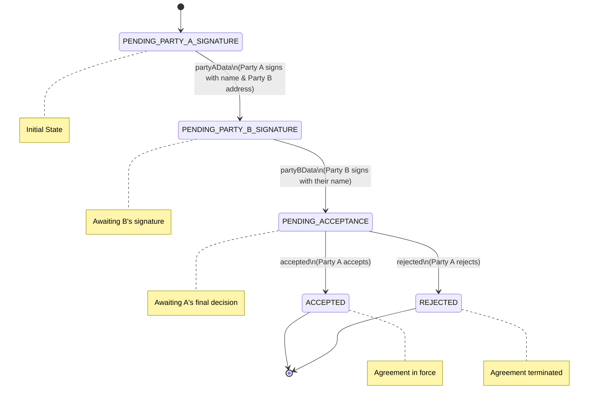

# Simple Grant Agreement Overview

This document defines a non-binding Memorandum of Understanding (MOU) between two parties, implemented as a smart agreement with a structured workflow for signatures and acceptance.

## Agreement Structure

### Metadata
- **ID**: `did:example:mou-v1`
- **Template ID**: `did:template:mou-v1`
- **Version**: 1.0.0
- **Author**: Agreements Protocol
- **Type**: Memorandum of Understanding

### Key Participants
1. **Party A**
   - Must provide legal name
   - Must provide Ethereum address of Party B
   - EIP712 Signs against Party A Data
   - Reviews Party B data and then either Accepts or Rejects via another signature
   
2. **Party B**
   - Must provide legal name
   - EIP712 Signs against Party B Data

### Agreement Content
The MOU includes comprehensive sections covering:
- Introduction and purpose
- Roles and responsibilities of both parties
- Term and termination conditions
- Financial arrangements (no fund exchange)
- Confidentiality provisions
- Intellectual property rights
- Dispute resolution procedures
- Compliance requirements
- Amendment procedures
- Non-binding nature declarations
- Notice requirements
- Signature requirements

### Execution Flow Diagram

### Signature Process
1. **Initial Stage**: Party A initiates by providing their signature along with Party B's address
2. **Secondary Stage**: Party B confirms by signing with their details
3. **Final Stage**: Party A makes the final decision to either accept or reject the agreement

### Verification Method
- All signatures are implemented using EIP712 verified credentials
- Each signature requires specific data validation:
  - Party A's initial signature includes their name and Party B's address
  - Party B's signature includes their name
  - Final acceptance/rejection requires explicit "ACCEPTED" or "REJECTED" string

### Security Features
- All signatures are cryptographically verified through Ethereum addresses
- Each state transition requires valid credential verification
- Specific address validation for Party A (hardcoded in template)
- Input validation for all required fields

This MOU template provides a structured, secure, and transparent way to establish a non-binding agreement between two parties, with clear state transitions and verification requirements at each step of the process.
